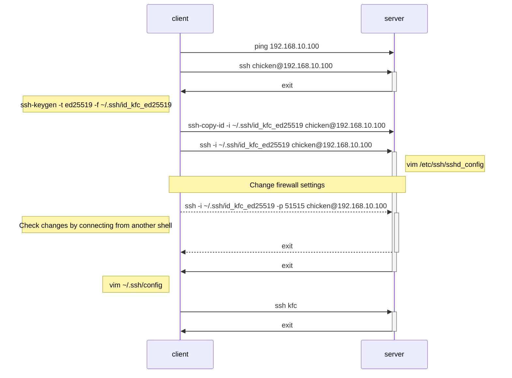

# SSH memo

My personal memo for SSH.

Options are mostly WIP.

NOTE: This is NOT a tutorial; more of a ssh cookbook.

Because `man ssh` sucks.

## Prerequisites

You have a basic understanding about:

- what SSH is for; to connect to another computer
- how public key authentication works
- networking, computer stuff in general

## Actors

Throughout this document, I will verbosely clarify which is the `ssh server` and `ssh client`.

Every web article and tutorial fucks up on which is which.
All those web article should be purged.

Here I will use the following term.

- `host`: ssh server
- `client`: ssh client

For cases where the role of server and client switch, such as `ssh -R`,
I will keep refering them in the role in the **INITIAL** SSH connection has been established.

There will be explanation in places where it gets complicated.

## General Best Practices

### Disable password authentication

Duh.

### Caution When Changing Settings; Don't Logout!

When changing ssh settings on a ssh server, keep the connection alive until you are sure that you made the right changes.

The current connection will not be affected by the changes on the host you made.

If you messed up the changes and disconnected from the host, you might not be able to reconnect.

On the client, try to connect to the host from a different shell and check and double check you can successfully connect.

Just use `tmux`.

## General Config Files

Not all. Just the common ones.

### Host

- `~/.ssh/authorized_keys`: ssh client public keys
- `/etc/ssh/`: ssh server config dire
  - `/sshd_config`: ssh server config
  - ssh server keys are here too

### Client

- `~/.ssh/`: ssh client config
  - `config`: set alias for running ssh command
  - `known_hosts`: ssh server public keys
  - ssh client keys are here too

## General setup

Example in Debian based Linux.

From ssh client: `<ssh server user name>@<ssh server address>`

- `host`: chicken@192.168.10.100
- `client`: egg@192.168.10.10



### Install

```bash
# on client (apt)
sudo apt update
sudo apt install openssh-client
```

```bash
# on host (apt)
sudo apt update
sudo apt install openssh-server
```

### Firewall

```bash
# on both host and client (ufw)
sudo ufw enable
sudo ufw allow ssh
sudo ufw reload
```

### Enable SSH server

```bash
# on host (systemd)
sudo systemctl status ssh
sudo systemctl start ssh
sudo systemctl enable ssh
```

### Initial Connection

```bash
# on client
# check if server is alive (depends on ICMP settings)
ping 192.168.10.100
```

```bash
# on client
ssh checken@192.168.10.100
```

### Generate key-pair

From client: `ssh-keygen -t <key type> -f <file path> -c <comment>`

- `-t`: use ed25519 if not sure
- `-f`: my rule is `~/.ssh/id_<host name>_<key type>`
- `-c`: I don't use it that much

```bash
# on client
ssh-keygen -t ed25519 -f ~/.ssh/id_kfc_ed25519
```

For security, it's better to passphrase.

`Passphrase` itself have nothing to do with ssh.
It's required for anything trying to access the private key.

#### Send public key to host

From client: `ssh-copy-id -i <private key> <host user>@<host address>`

```bash
# on client
ssh-copy-id -i ~/.ssh/id_kfc_ed25519 chicken@192.168.10.100
```

### Connect via public key auth

From client: `ssh -i <private key> <host user>@<host address>`

```bash
# on client
ssh -i ~/.ssh/id_kfc_ed25519 chicken@192.168.10.100
```

### Change SSH config

Change SSH settings in SSH server.

As stated [above](#)

The settings are in `/etc/ssh/sshd_config`. (ssh*d* for daemon)

As stated [above](#), be careful not to get locked out of the server when changing settings.

- Use `ssh -o` to individually change item
- Directly edit `sshd_config`

Before editing, create backup of config.

```bash
sudo cp /etc/ssh/sshd_config /etc/ssh/sshd_config.bak
sudo chmod a-w /etc/ssh/sshd_config.bak

sudo vim /etc/ssh/sshd_config
```

Must be changed:

- `PermitRootLogin no`
- `PaawordAuthentication no`
- `ForwardX11Trusted no`

Better to be changed:

- `X11Forwarding no`: if not using remote desktop
- `Port <set unused port>`: better to change from `22`

If not sure which port to use see [Wikipedia](https://en.wikipedia.org/wiki/List_of_TCP_and_UDP_port_numbers) and choose something that's not likely used.

When changing port, don't forget to change firewall settings on client.

```bash
# on client (ufw)
sudo ufw allow 51515
sudo ufw status numbered # check number of rule added above
sudo ufw delete <rule number of allow 51515>
sudo ufw reload
sudo ufw status # check
``` 

Check settings: **Keep current connection alive** and reconnect from **another shell**

`ssh -i <private key> -p <server port number> <server user>@<server address>`

```bash
# on client
# from another shell
ssh -i ~/.ssh/id_kfc_ed25519 -p 51515 chicken@192.168.10.100
```

### Edit `~/.ssh/config`

The ssh command is long so create an alias in `~/.ssh/config`.

If `~/.ssh/config` doesn't exist, create.

```bash
touch ~/.ssh/config
chmod 600 ~/.ssh/config
```

Add the following.
Options for ssh_config can be used, so see `man ssh` for details.

```bash
# add to ~/.ssh/config

# connect by: ssh kfc
Host kfc
  HostName 192.168.10.100
  Port 51515
  IdentityFile ~/.ssh/id_kfc_ed25119
```

Now you can connect with:

```bash
# same as ssh -i ~/.ssh/id_kfc_ed25519 -p 51515 chicken@192.168.10.100
ssh kfc
```
