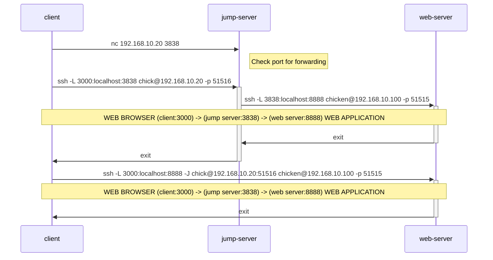
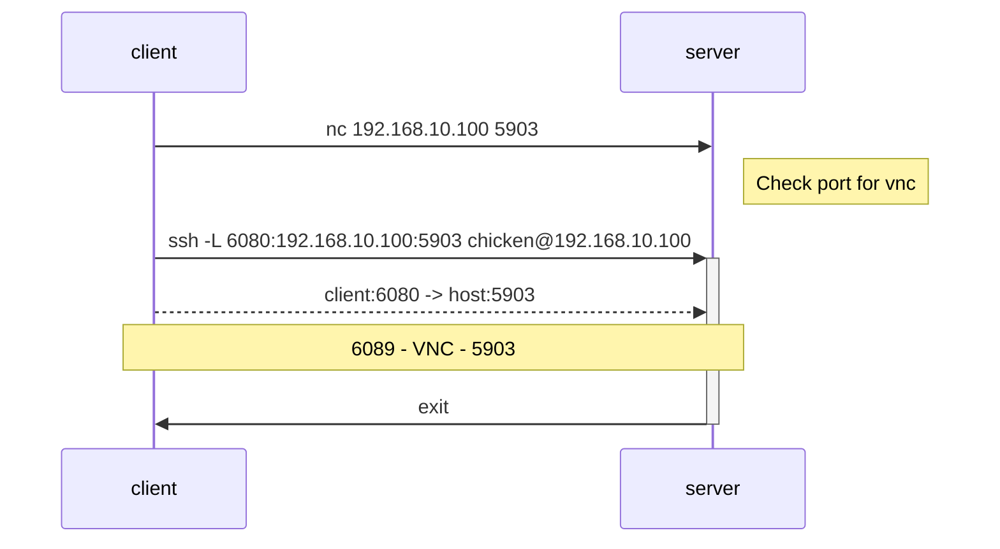

# `ssh -L`

- `-L`/`LocalForward`: Local port forwarding
- `-W`: TCP stream
- `-J`: ProxyJump; often used together

See `man ssh` for details.

Create SSH tunnel to forward: **client port** -> **host port**

## Cheat Sheet

Port forward `<host address>:<host port>` -> `<client address>:<client port>`

From client shell:

`ssh -L [<client address>:]<client port>:<host address (seen from host)>:<host port> <host user>@<host address>`

`<host address (seen from host)>` is usually `localhost`.
In this usage, `localhost` is **NOT the client address**.
This part is passed to the host, which is perceived as the host's `localhost`; i.e. the host address.

## Use Cases

When we want to access a certain port on a server, but the server is behind a firewall.

- VNC
- Web Apps over HTTP/HTTPS 
  - Web GUI (Proxmox, TrueNAS, etc.)
  - Jupyter Lab
  - RStudio Server

## Example: Tunnelling a web app (HTTP/HTTPS) over a jump server

- `web server`: chicken@192.168.10.100
  - ssh port: 51515
  - webapp port: 8888
- `jump server`: chick@192.168.10.20
  - ssh port: 51516
  - bind port: 3838
- `client`: egg@192.168.10.10
  - bind port: 3000
 
NOTE: `-i` (identity file) are absent in below, but it is needed.
I assumed anyone who will be reading this should know this so if you're not sure, start from the basics.




## Example: noVNC

- `host`: chicken@192.168.10.100
  - ssh port: 51515
  - forward destination port: 5903 
- `client`: egg@192.168.10.10
  - forward source port: 6080



Install noVNC.

```bash
sudo snap refresh
sudo snap install novnc
```

VNC will automatically assign the ports 5900, 5901, 5902,... if multiple connections are made.

Use netcat to see if port on host is open.

```bash
# on client
nc -z 192.168.10.100 5903
```

Create SSH tunnel.

```bash
ssh -L 6080:192.168.10.100:5903 chicken@192.168.10.100
```

Start noVNC.

From client: `novnc --listen <client port> --vnc <host port>`

```bash
novnc --listen 6080 --vnc 5903
```

Access URL shown on terminal: `http://<client hostname>:<client port>/vnc.html?host=<client hostname>&port=<client port>`
