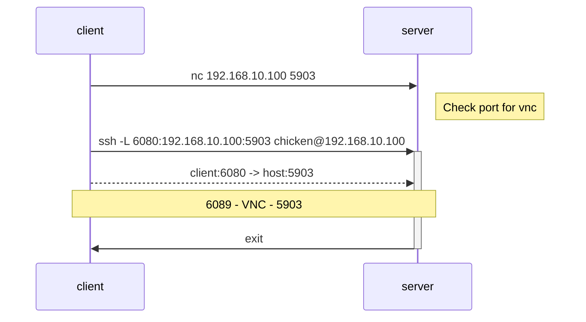

# `ssh -L`

`-L` (local port forwarding).
See `man ssh` for details.

Create SSH tunnel to forward: **client port** -> **host port**

## Cheat Sheet

From client: `ssh -L [<client address>:]<client port>:<host address>:<host port> <host user>@<host address>`

## Use Cases

- vnc
- web GUI
- Jupyter, RStudio server

## Example: Jupyter Server

For using HTTP/HTTPS, see [Jupyter server docs](https://jupyter-server.readthedocs.io/en/latest/operators/public-server.html)


- `host`: chicken@192.168.10.100
  - ssh port: 51515
  - forward destination port: 8888
- `client`: egg@192.168.10.10
  - ssh port: 51515
  - forward source port: 6080


```bash
# on host
pip install jupyterlab
```

```bash
# on clietnt
```

## Example: TrueNAS web-GUI

## Example: noVNC

- `host`: chicken@192.168.10.100
  - ssh port: 51515
  - forward destination port: 5903 
- `client`: egg@192.168.10.10
  - ssh port: 51515
  - forward source port: 6080



Install noVNC.

```bash
sudo snap refresh
sudo snap install novnc
```

VNC will automatically assign the ports 5900, 5901, 5902,... if multiple connections are made.

Use netcat to see if port on host is open.

```bash
# on client
nc -z 192.168.10.100 5903
```

Create SSH tunnel.

```bash
ssh -L 6080:192.168.10.100:5903 chicken@192.168.10.100
```

Start noVNC.

From client: `novnc --listen <client port> --vnc <host port>`

```bash
novnc --listen 6080 --vnc 5903
```

Access URL shown on terminal: `http://<client hostname>:<client port>/vnc.html?host=<client hostname>&port=<client port>`
