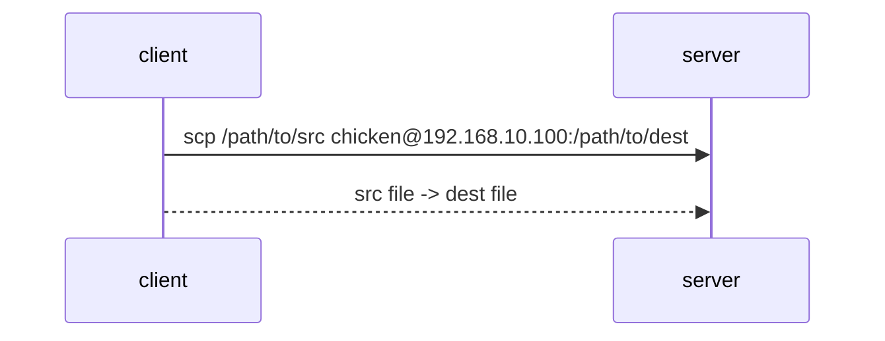
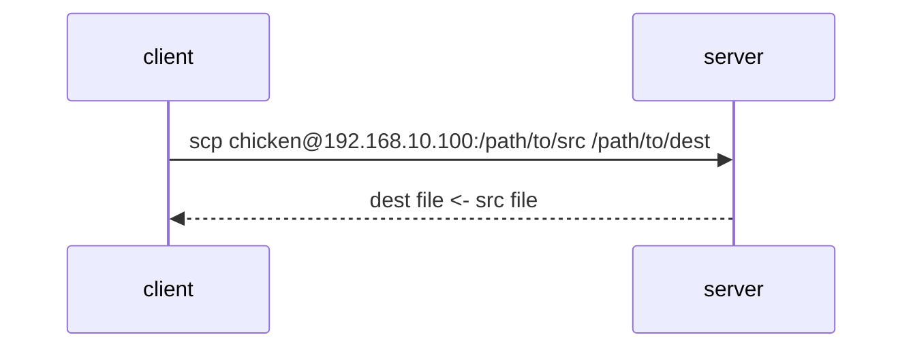

# Miscellaneous Tasks

## Secure Copy

Copy file from through SSH.

`scp <src> <dest>`

### client -> host

From client: `scp <client source file path> <host user>@<host address>:<host destination file path>`



### host -> client

From client: `scp <host user>@<host address>:<host source file path> <client destination file path>`



## SFTP

SSH File Transfer Protocol.

`sftp <host user>@<host address>`

```bash
sftp chicken@192.168.10.100
```

See `man sftp` -> INTERACTIVE COMMANDS

- **host** -> **client**: `get`
- **client** -> **host**: `put`

Or... just use `midnight commande`.

```bash
sudo apt update
sudo apt install mc
```

## SSH to Link Local Machine


## Change/Remove Passphrase from Private Key

```bash
ssh-keygen -p -f <path/to/eprivate key>
```

## BkSp/Tab/etc. keys don't work after SSH connection

I experienced this on: SSH client with foot -> OpenSuse SSH server

This is because the stty settings that are usually handled automaticaly didn't work for some reason.

See [stackoverflow](https://unix.stackexchange.com/questions/43103/backspace-tab-not-working-in-terminal-using-ssh).

If setting environment variable `$TERM` worked, add the following to `~/.bashrc`/`~/.zshrc`.

```
# add to ~/.zshrc
if [[ -n $SSH_CONNECTION ]]; then
    export TERM='vt100'
fi
```
