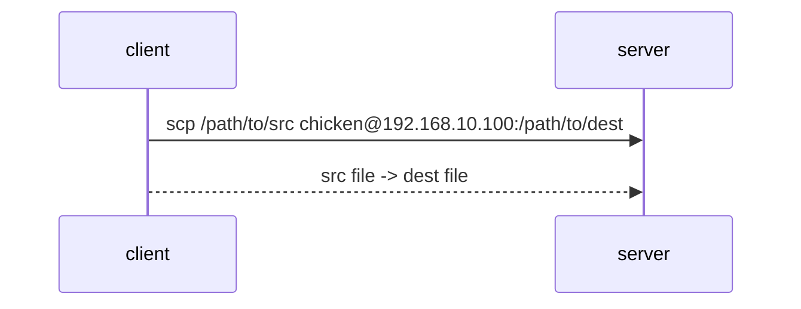
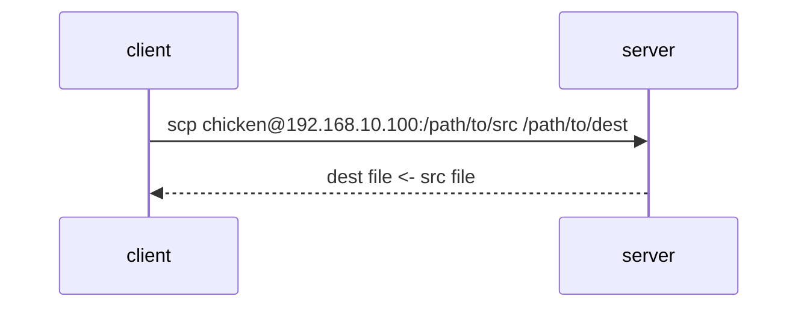

# Miscellaneous Tasks

## Secure Copy

Copy file from through SSH.

`scp <src> <dest>`

### client -> host

From client: `scp <client source file path> <host user>@<host address>:<host destination file path>`



### host -> client

From client: `scp <host user>@<host address>:<host source file path> <client destination file path>`



## SFTP

SSH File Transfer Protocol.

`sftp <host user>@<host address>`

```bash
sftp chicken@192.168.10.100
```

See `man sftp` -> INTERACTIVE COMMANDS

- **host** -> **client**: `get`
- **client** -> **host**: `put`

Or... just use `midnight commande`.

```bash
sudo apt update
sudo apt install mc
```

## SSH to Link Local Machine


## Change/Remove Passphrase from Private Key

```bash
ssh-keygen -p -f <path/to/eprivate key>
```
