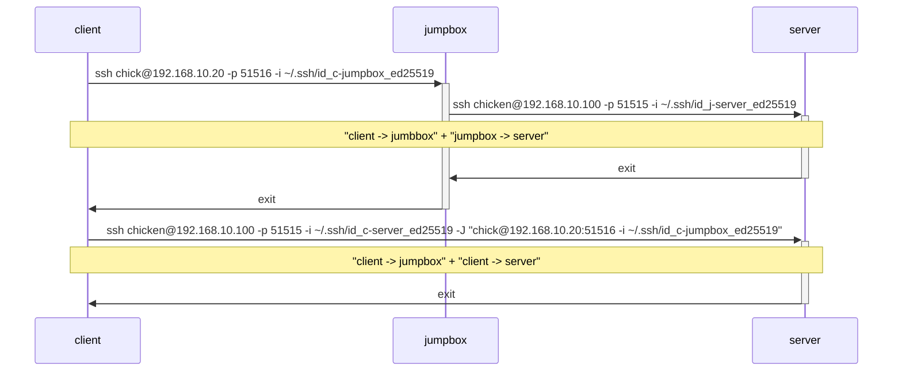

# `ssh -J`

- ProxyJump

## Use Cases

When we want to access a certain server, but the server is behind a firewall/NAT.

## Cheat Sheet

`ssh <to final destination> -J <to intermediate destination>`

`ssh <final destination user>@<final destination address> -p <final destination port> -J <intermediate user>@<intermediate address>:<intermediate port>`

`ssh <final user>@<final addr> -p <final port> -i <clinet-final identity file> -J "<intermediate user>@<intermediate addr>:<intermediate port> -i <client-intermediate identity file>"`

## Example: Accessing a server via a jumpbox

- `server`: chicken@192.168.10.100
  - ssh port: 51515
- `jumpbox`: chick@192.168.10.20
  - ssh port: 51516
- `client`: egg@192.168.10.10

Key pairs

- `client`
  -`~/.ssh/id_c-jumpbox_ed25519` # client-jumpbox
  - `~/.ssh/id_c-server_ed25519` # client-server
- `jumpbox`
  - `~/.ssh/id_j-server_ed25519` # jumpbox-server
 
`ssh chicken@192.168.10.100 -p 51515 -i ~/.ssh/id_c-server_ed25519 -J "chick@192.168.10.20:51516 -i ~/.ssh/id_c-jumpbox_ed25519"`



### `~/.ssh/config`

From client: `ssh server`

```bash
# client ~/.ssh/config

# client -> jumpbox
Host jumpbox
  HostName 192.168.10.20
  Port 51516
  User chick
  IdentityFile ~/.ssh/id_c-jumpbox_ed25519

# client -> jumpbox -> server
Host server
  HostName 192.168.10.100
  Port 51515
  User chicken
  IdentityFile ~/.ssh/id_c-server_ed25519
  ProxyJump jumpbox
```

Jumpbox -> server ssh is not necessary but good to have for debugging.

```bash
# jumpbox ~/.ssh/config

# jumpbox -> server
Host server
  HostName 192.168.10.100
  User chicken
  Port 51515
  IdentityFile ~/.ssh/id_j-server_ed25519
```
