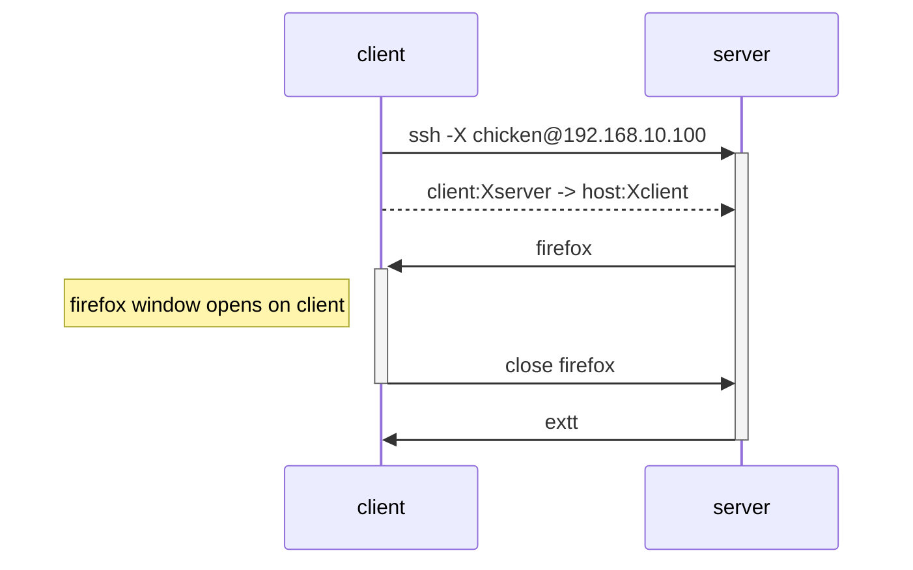

# port forwarding (remote desktop and reverse shell)

## `-X` `-Y` (X11 forwarding)

- `-X`: treat host as untrusted machine
  - option `ForwardX11`
- `-Y`: treat host as trusted machine
  - option `ForwardX11Trusted`

Better to avoid using `-Y` for security.

Set `ForwardX11Trusted no` in `ssh_config`.

### Cheatsheet

From client: `ssh -X <host user>@<host address>`

### Example



```bash
# on client
ssh -X -i ~/.ssh/id_kfc_ed25519 -p 51515 chicken@192.168.10.100
```

Check the display ID.
Returns `localhost:<display ID>`.

```
bash
# on host
echo $DISPLAY # localhost:12.0
```

TODO: X11 Forwarding not finished.

> `localhost` is the host address seen from host itself.
> Using other server instead of `localhost` needs config changes.

### Example (reverse shell)
